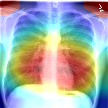

# CheXNet

This repository contains the code of PyTorch version for CheXNet introduced in the following paper:

[CheXNet: Radiologist-Level Pneumonia Detection on Chest X-Rays with Deep Learning][https://arxiv.org/pdf/1711.05225.pdf]

The heat map of proceeding implementation:

Meanwhile, the heat map image of our implementation:

## Prerequisites

- Python 3.6.7
- Torch 1.0.0 && TorchVision 0.2.1
- OpenCV-Python 3.4.4.19 (for generating CAM heat map picture)

## Usage

- Run `pip3 install -r requirements.txt` to install required python packages
- Make sure you have correctly installed and configured CUDA
- Download the ChestX-ray14 database from [here](https://nihcc.app.box.com/v/ChestXray-NIHCC/folder/37178474737)
- Unpack archives in separate directories (e.g. images_001.tar.gz into images_001) into `dataset_images` folder
- Run `python main.py` to run test using the pre-trained model (`model0122.pth.tar`)
- Use the **start_train()** function in the **main.py** to train a model from scratch
- Run `python generate_heatmap.py` to predict and get a heat map of `./heat_map/raw.png`

- Change parameters(filepath, hyperparameters e.g.) if you like

## Results

| **病理**         | Wang et al. | Yao et al. | **CheXNet**  | **复现结果** |
| ---------------- | ----------- | ---------- | ------------ | ------------ |
| **肺不张**       | 0.716       | 0.772      | **0.8094**   | **0.8267**   |
| **心脏肥大**     | 0.807       | 0.904      | **0.9248**   | **0.8998**   |
| **积液**         | 0.784       | 0.859      | **0.8638**   | **0.8823**   |
| **渗透**         | 0.609       | 0.695      | **0.7345**   | **0.7135**   |
| **粘连**         | 0.706       | 0.792      | **0.8676**   | **0.8586**   |
| **结节**         | 0.671       | 0.717      | **0.7802**   | **0.7921**   |
| **肺炎**         | 0.633       | 0.713      | **0.768**    | **0.7577**   |
| **气胸**         | 0.806       | 0.841      | **0.8887**   | **0.8727**   |
| **肺实变**       | 0.708       | 0.788      | **0.7901**   | **0.8078**   |
| **肺水肿**       | 0.835       | 0.882      | **0.8878**   | **0.9002**   |
| **气肿**         | 0.815       | 0.829      | **0.9371**   | **0.9267**   |
| **囊肿性纤维化** | 0.769       | 0.767      | **0.8047**   | **0.8510**   |
| **胸膜增厚**     | 0.708       | 0.765      | **0.8062**   | **0.7900**   |
| **疝气**         | 0.767       | 0.914      | **0.9164**   | **0.9403**   |
| **Mean**         | 0.738143    | 0.802714   | **0.841379** | **0.844243** |

## Computation Time

The training was done using eight Tesla V100 GPUs and took approximately 10h reaching 200 epoches.